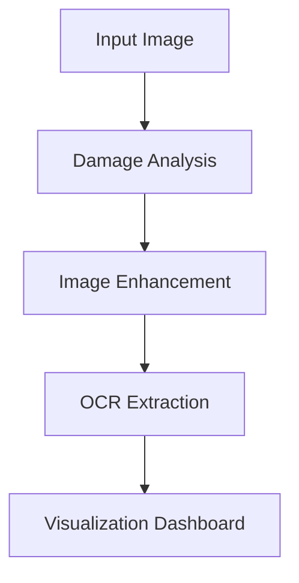

# 📚 Book Time Machine

### 🧠 AI-Powered Historical Document Restoration System

  
  
  
  

---

  

---

## 🚀 Overview

**Book Time Machine** is an intelligent AI system that restores degraded historical documents using advanced:

* 🖼️ Image Processing
* 👁️ Computer Vision
* ✍️ OCR (Optical Character Recognition)
* 📊 Visual Analytics

It transforms **old, damaged, and noisy documents** into **clean, readable, and structured digital content**.

---

## 🧠 Core Idea

> Not just image enhancement — but **full document intelligence**

The system:

* Restores images
* Detects damage
* Extracts text
* Evaluates quality
* Visualizes every step

---

## ⚙️ System Pipeline

---

## 🔥 Core Innovations

### 🥇 Comparison Engine

  

* Original Image
* Processing Stages
* Final Restored Output

👉 Shows **step-by-step transformation**

---

### 🥈 Damage Heatmap

  

* 🔴 Damaged regions
* 🟡 Medium degradation
* 🟢 Clean areas

👉 Visualizes **where the document is broken**

---

### 🥉 OCR Confidence Map

  

* 🟢 High confidence text
* 🟡 Medium confidence
* 🔴 Low confidence

👉 Not just text — but **trust-aware OCR output**

---

## 💻 Tech Stack

---

## 🖥️ Features

* 📤 Upload old document images
* 🔍 Damage detection & analysis
* 🎨 Image restoration pipeline
* ✍️ OCR text extraction
* 📊 Confidence visualization
* ⚡ Real-time Streamlit UI

---

## 📊 Output Examples

| Stage      | Output               |
| ---------- | -------------------- |
| Input      | 📄 Degraded document |
| Analysis   | 🔥 Damage heatmap    |
| Processing | 🧠 Enhanced image    |
| Output     | ✍️ Extracted text    |

---

## 🌟 Project Value

✔ Preserves historical documents
✔ Restores unreadable content
✔ Visualizes degradation scientifically
✔ Evaluates OCR accuracy
✔ Provides full AI pipeline transparency

---

## 🏁 Conclusion

The **Book Time Machine** is a complete AI system that combines:

> 🧠 Intelligence + 🖼️ Vision + ✍️ Text + 📊 Analytics

to reconstruct and understand historical documents like never before.

---

## 👨‍💻 Developer Notes

> Built with passion for Computer Vision, AI, and Digital Preservation.

---

## ⭐ If you like this project

Give it a ⭐ on GitHub to support development!

---
